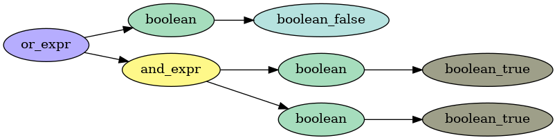
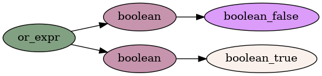
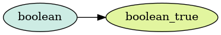
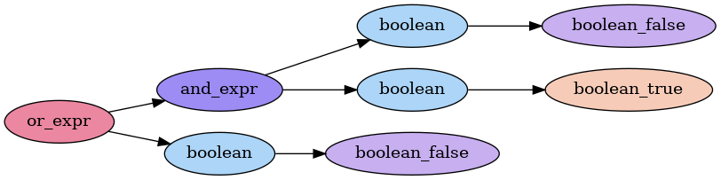
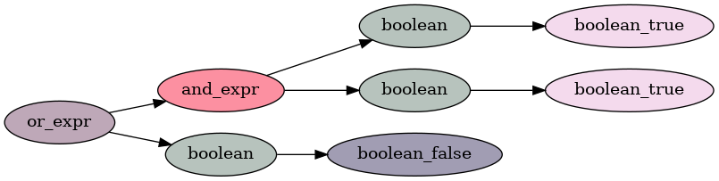

# Lark Syntax Tree

## Boolean Tree Example

When Lark parses an expression, it produces a syntax tree. In our Mini Query Language, all expressions ultimately evaluate to a boolean — meaning that the tree can be "folded" inward from the leaves to produce a `True` or `False` result.

Take the expression:

```text
false or true and true
```

This is parsed into the following tree:



Operator Precedence: Just like in BEDMAS (order of operations), logical operators have precedence. In our language, `and` binds more tightly than `or`, so the tree evaluates the `and` branch first and becomes:



Now `false or true` is evaluated, leaving us with:



---

## Extending the Tree with Comparisons

Since the Mini Query Language is built on boolean logic, other constructs (like comparisons) are also treated as boolean expressions.

For example, take:

```text
country == "New Zealand" and true or false
```

This is parsed into:


### Evaluation Depends on Context

If `country != "New Zealand"`, then the comparison is false, and the tree simplifies to:

```text
false and true or false
```



If `country == "New Zealand"`, then the comparison is true, and the tree becomes:

```text
true and true or false
```



And so on!

---

## Summary

- Lark builds structured syntax trees based on grammar rules and precedence.
- The Mini Query Language evaluates expressions from the leaves up.
- Precedence rules are baked into the grammar (e.g., `and` binds tighter than `or`).
- Comparisons like `==` become booleans that slot into logical expressions.

Visualizing the trees helps explain **why** an expression evaluates the way it does, and makes operator precedence obvious.
